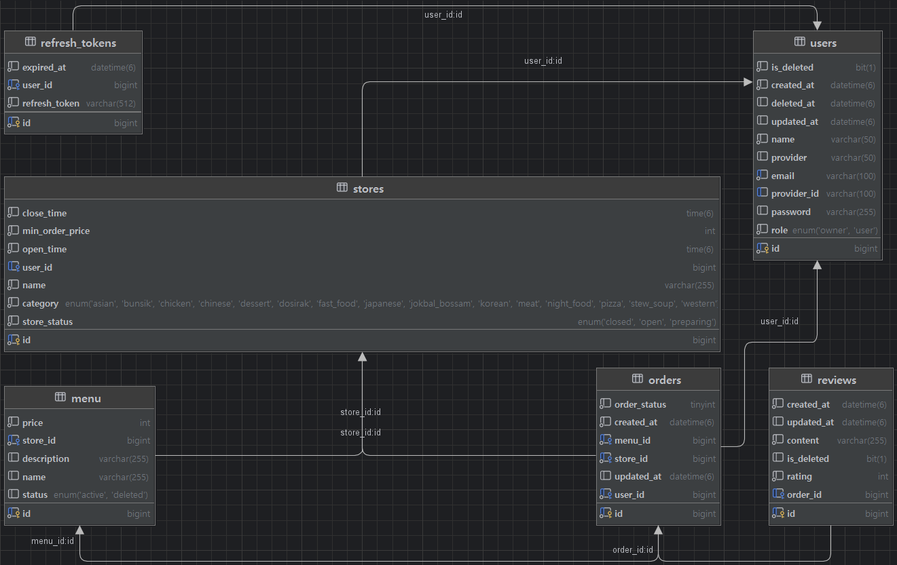
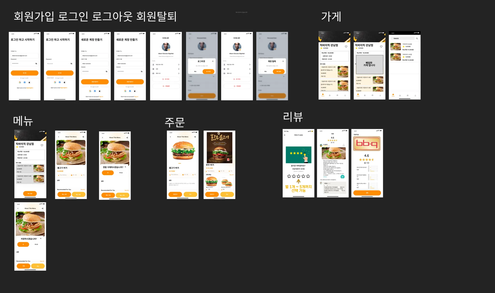

# 📰 Outsourcing Project

## 📌 프로젝트 소개

배달의 민족과 유사한 배달 서비스 웹 애플리케이션을 개발하는 팀 과제입니다.  
사용자는 음식 주문, 메뉴 선택, 리뷰 작성 등의 기능을 제공받고,  
관리자는 가게와 메뉴를 효율적으로 관리할 수 있는 시스템을 제공합니다.  
**Spring Boot**와 **JWT 인증**을 활용하여 안전하고 확장 가능한 서비스를 구현했습니다.

## 🗓 개발 기간 🕰

- 2025.04.22 화 - 2025.04.29 화

## 🎯 프로젝트 목적

- 이 프로젝트의 목적은 **배달 서비스**의 핵심 기능을 구현하는 것입니다.
- 사용자와 관리자 간의 상호작용을 원활하게 하고,
- 주문, 가게 관리, 리뷰 작성 등을 포함한 다양한 기능을 제공하여
- 사용자 경험을 개선하는 것을 목표로 합니다.
- 또한 **Spring Boot**와 **JWT 인증**을 활용해 보안성과 확장성을 확보하는 것을 목표로 합니다.

---

## 🛠 **사용 기술 스택**

## 기술 스택

### 백엔드

| 분야            | 기술              |
|---------------|-----------------|
| **프레임워크**     | Spring Boot     |
| **보안**        | Spring Security |
| **데이터베이스**    | MySQL           |
| **데이터 처리**    | Spring Data JPA |
| **인증 관리**     | JWT             |
| **로깅 & 트랜잭션** | AOP             |
| **API 호출**    | WebClient       |

### 도구 및 협업

| 분야         | 기술     |
|------------|--------|
| **버전 관리**  | Git    |
| **저장소 관리** | Github |
| **빌드 도구**  | Maven  |

---

# 📚 **5조 API 문서**

<br>

### 👨‍👩‍👦 **USER API 명세서**

| 기능        | Method | URL                 | PathVariable | RequestParam    | RequestBody (내용)                                                                                                                   | ResponseBody (내용)                                                                                             | 상태코드               | 예외 메시지                                                                                                        |
|-----------|--------|---------------------|--------------|-----------------|------------------------------------------------------------------------------------------------------------------------------------|---------------------------------------------------------------------------------------------------------------|--------------------|---------------------------------------------------------------------------------------------------------------|
| 회원가입      | POST   | /api/auth/signup    | -            | -               | "{\n  \"email\": \"example@example.com\",\n  \"password\": \"StrongPass1!\",\n  \"nickname\": \"user1\",\n  \"role\": \"USER\"\n}" | "{\n  \"id\": 1,\n  \"email\": \"example@example.com\",\n  \"nickname\": \"user1\",\n  \"role\": \"USER\"\n}" | 201, 400           | "이메일 형식이 아닙니다." (400), "이메일은 필수입니다." (400), "비밀번호는 필수입니다." (400), "닉네임은 필수입니다." (400), "이미 가입된 이메일입니다." (400) |
| 회원 탈퇴     | DELETE | /api/users/withdraw | -            | email, password | -                                                                                                                                  | -                                                                                                             | 200, 400, 404, 422 | "사용자를 찾을 수 없습니다." (404), "이미 탈퇴한 사용자입니다." (422), "비밀번호가 일치하지 않습니다." (400)                                     |
| 마이페이지 조회  | GET    | /api/users/me       | -            | -               | -                                                                                                                                  | "{\n  \"id\": 1,\n  \"email\": \"example@example.com\",\n  \"nickname\": \"user1\",\n  \"role\": \"USER\"\n}" | 200, 401, 404      | "로그인 해주세요." (401), "사용자를 찾을 수 없습니다." (404)                                                                    |
| 사용자 단건 조회 | GET    | /api/users/{id}     | id           | -               | -                                                                                                                                  | "{\n  \"id\": 1,\n  \"email\": \"example@example.com\",\n  \"nickname\": \"user1\",\n  \"role\": \"USER\"\n}" | 200, 404           | "사용자를 찾을 수 없습니다." (404)                                                                                       |

---

### 🔐 **Login API 명세서**

| 기능        | Method | URL                            | PathVariable | RequestParam    | RequestBody (내용)                                                                | ResponseBody (내용)                                                                                                                                                 | 상태코드          | 예외 메시지                                                  |
|-----------|--------|--------------------------------|--------------|-----------------|---------------------------------------------------------------------------------|-------------------------------------------------------------------------------------------------------------------------------------------------------------------|---------------|---------------------------------------------------------|
| 로그인       | POST   | /api/auth/login                | -            | -               | "{\n  \"email\": \"example@example.com\",\n  \"password\": \"StrongPass1!\"\n}" | "{\n  \"accessToken\": \"jwt-token\",\n  \"refreshToken\": \"jwt-refresh-token\" \n}"                                                                             | 200, 400, 500 | "이메일 또는 비밀번호가 잘못되었습니다." (400), "이미 탈퇴한 사용자 입니다." (500)  |
| 토큰 갱신     | POST   | /api/auth/refresh              | -            | -               | "{\n  \"refreshToken\": \"jwt-refresh-token\"\n}"                               | "{\n  \"accessToken\": \"new-jwt-token\"\n}"                                                                                                                      | 200, 400, 401 | "유효하지 않은 refresh token입니다." (400), "로그인 해주세요." (401)    |
| 로그아웃      | POST   | /api/auth/logout               | -            | -               | -                                                                               | -                                                                                                                                                                 | 200, 401      | "로그인 해주세요." (401)                                       |
| Oauth 로그인 | GET    | /api/auth/login/kakao/callback | -            | Code(카카오 인가 코드) | -                                                                               | "{\n  \"accessToken\": \"eyJhbGci...\",\n  \"user\": {\n    \"id\": 1,\n    \"email\": \"kakao@example.com\",\n    \"name\": \"홍길동\",\n    \"role\": \"USER\"\n}" | 200, 400, 500 | "카카오 API 연동에 실패했습니다." (400), "내부 처리에 오류가 발생했습니다." (500) |

---

### 📃 **Store API 명세서**

| 기능       | Method | URL                                                | PathVariable | RequestParam   | RequestBody (내용)                                                                                                                                | ResponseBody (내용)                                                                                                                                                                                                                                                                                         | 상태코드    | 예외 메시지                                                                                                                   |
|----------|--------|----------------------------------------------------|--------------|----------------|-------------------------------------------------------------------------------------------------------------------------------------------------|-----------------------------------------------------------------------------------------------------------------------------------------------------------------------------------------------------------------------------------------------------------------------------------------------------------|---------|--------------------------------------------------------------------------------------------------------------------------|
| 가게 생성    | POST   | /api/stores                                        | -            | -              | "{\n  \"name\": \"가게명\",\n  \"openTime\": \"08:00\",\n  \"closeTime\": \"22:00\",\n  \"minOrderPrice\": 10000,\n  \"category\": \"음식점\"\n}"     | "{\n  \"id\": 1,\n  \"name\": \"가게명\",\n  \"openTime\": \"08:00\",\n  \"closeTime\": \"22:00\",\n  \"minOrderPrice\": 10000,\n  \"storeStatus\": \"OPEN\",\n  \"category\": \"음식점\"\n}"                                                                                                                   | 201     | "가게명은 필수값입니다.\n오픈 시간은 필수값입니다.\n마감 시간은 필수값입니다.\n최소주문금액은 필수값입니다.\n카테고리는 필수값입니다."                                           |
| 가게 조회    | GET    | /api/stores/{id}                                   | id           | -              | -                                                                                                                                               | "{\n  \"id\": 1,\n  \"name\": \"가게명\",\n  \"openTime\": \"08:00\",\n  \"closeTime\": \"22:00\",\n  \"minOrderPrice\": 10000,\n  \"storeStatus\": \"OPEN\",\n  \"category\": \"음식점\",\n  \"menuResponseList\": [\n    {\n      \"id\": 1,\n      \"name\": \"메뉴명\",\n      \"price\": 5000\n    }\n  ]\n}" | 200     | "요청하신 가게를 찾을 수 없습니다."                                                                                                    |
| 가게 목록 조회 | GET    | /api/stores or /api/stores?name=가게명&page=1&size=10 | -            | 페이지, 사이즈, Name | -                                                                                                                                               | "{\n  \"storeList\": [\n    {\n      \"id\": 1,\n      \"name\": \"가게명\",\n      \"minOrderPrice\": 10000\n    }\n  ],\n  \"currentPage\": 1,\n  \"size\": 10,\n  \"first\": true,\n  \"last\": false\n}"                                                                                                 | 200     | "가게 목록을 불러올 수 없습니다."                                                                                                     |
| 가게 수정    | PUT    | /api/stores/{id}                                   | id           | -              | "{\n  \"name\": \"수정된 가게명\",\n  \"openTime\": \"09:00\",\n  \"closeTime\": \"22:00\",\n  \"minOrderPrice\": 12000,\n  \"category\": \"음식점\"\n}" | "{\n  \"id\": 1,\n  \"name\": \"수정된 가게명\",\n  \"openTime\": \"09:00\",\n  \"closeTime\": \"22:00\",\n  \"minOrderPrice\": 12000,\n  \"category\": \"음식점\"\n}"                                                                                                                                             | 200     | "가게명은 20자 이내로 작성해주세요.\n오픈 시간은 00:00 형식으로 입력해야 하며, 24시간제입니다.\n마감 시간은 00:00 형식으로 입력해야 하며, 24시간제입니다.\n카테고리는 올바른 값을 입력해주세요." |
| 가게 삭제    | DELETE | /api/stores/{id}                                   | id           | -              | -                                                                                                                                               | "{\n  \"id\": 1,\n  \"name\": \"가게명\",\n  \"category\": \"음식점\",\n  \"message\": \"가게가 성공적으로 삭제되었습니다.\"\n}"                                                                                                                                                                                               | 200     | "가게가 성공적으로 삭제되었습니다.\n가게가 존재하지 않습니다."                                                                                     |
| 가게 리뷰 조회 | GET    | /api/stores/{storeId}/reviews                      | storeId      | -              | -                                                                                                                                               | "{\n  \"storeId\": 1,\n  \"reviews\": [\n    {\n      \"reviewId\": 1,\n      \"content\": \"좋은 가게\",\n      \"rating\": 5,\n      \"author\": \"사용자\"\n    }\n  ]\n}"                                                                                                                                    | 200 404 | "리뷰가 존재하지 않습니다."                                                                                                         |

---

### 🤝 **Menu API 명세서**

| 기능       | Method | URL                               | PathVariable    | RequestParam | RequestBody (내용)                                                              | ResponseBody (내용)                                                                          | 상태코드        | 예외 메시지 (상태 코드)                                                           |
|----------|--------|-----------------------------------|-----------------|--------------|-------------------------------------------------------------------------------|--------------------------------------------------------------------------------------------|-------------|--------------------------------------------------------------------------|
| 메뉴 생성    | POST   | /api/menus                        | 없음              | 없음           | json { "storeId": 1, "name": "메뉴 이름", "price": 1000, "description": "메뉴 설명" } | "{\n\"menuId\": 1,\n\"message\": \"메뉴가 등록되었습니다.\"\n}"                                      | 201 Created | "로그인이 필요합니다." (401) <br> "존재하지 않는 가게입니다." (404) <br> "권한이 없습니다." (403)   |
| 메뉴 목록 조회 | GET    | /api/menus/stores/{storeId}/menus | storeId (경로 변수) | -            | -                                                                             | "{\n\"menuId\": 1,\n\"name\": \"메뉴 이름\",\n\"price\": 1000,\n\"description\": \"메뉴 설명\"\n}" | 200 OK      | "가게를 찾을 수 없습니다." (404)                                                   |
| 메뉴 수정    | PUT    | /api/menus/{menuId}               | menuId (경로 변수)  | -            | json { "name": "수정된 메뉴 이름", "price": 1200, "description": "수정된 메뉴 설명" }       | "{\n\"menuId\": 1,\n\"message\": \"메뉴가 수정되었습니다.\"\n}"                                      | 200 OK      | "메뉴를 찾을 수 없습니다." (404) <br> "권한이 없습니다." (403) <br> "이미 삭제된 메뉴입니다." (400) |
| 메뉴 삭제    | DELETE | /api/menus/{menuId}               | menuId (경로 변수)  | -            | -                                                                             | "{\n\"data\": null,\n\"message\": \"메뉴가 삭제되었습니다.\"\n}"                                     | 200 OK      | "메뉴를 찾을 수 없습니다." (404) <br> "권한이 없습니다." (403) <br> "이미 삭제된 메뉴입니다." (400) |

---

### 🗨️ **Order API 명세서**

| 기능       | Method | URL                   | PathVariable | RequestParam | RequestBody (내용)                           | ResponseBody (내용)                                                                                                                                                                                                                                              | 상태코드                            | 예외 메시지                                                                                                                                                               |
|----------|--------|-----------------------|--------------|--------------|--------------------------------------------|----------------------------------------------------------------------------------------------------------------------------------------------------------------------------------------------------------------------------------------------------------------|---------------------------------|----------------------------------------------------------------------------------------------------------------------------------------------------------------------|
| 주문 생성    | POST   | /api/orders           | 없음           | -            | "{\n  \"storeId\": 1,\n  \"menuId\": 2\n}" | "{\n  \"id\": 1,\n  \"userId\": 1,\n  \"storeId\": 1,\n  \"menuId\": 2,\n  \"orderStatus\": \"REQUESTED\",\n  \"createdAt\": \"2025-04-28 12:00:00\"\n}"                                                                                                       | 201<br>400<br>401<br>403<br>404 | "로그인이 필요합니다." (401)<br>"존재하지 않는 가게입니다." (404)<br>"존재하지 않는 메뉴입니다." (404)<br>"본인 가게에는 주문할 수 없습니다." (403)<br>"가게가 현재 영업 중이 아닙니다." (400)<br>"최소 주문 금액을 충족하지 않습니다." (400) |
| 주문 상태 변경 | PUT    | /api/orders/status    | 없음           | -            | "{\n  \"orderId\": 1\n}"                   | "{\n  \"orderId\": 1,\n  \"userId\": 1,\n  \"storeId\": 1,\n  \"menuId\": 2,\n  \"orderStatus\": \"COOKING\",\n  \"createdAt\": \"2025-04-28 12:00:00\",\n  \"updatedAt\": \"2025-04-28 12:30:00\",\n  \"message\": \"Order status updated successfully.\"\n}" | 200<br>400<br>403<br>404        | "주문을 찾을 수 없습니다." (404)<br>"해당 가게의 사장님만 수정할 수 있습니다." (403)<br>"이미 완료된 주문입니다." (400)                                                                                   |
| 주문 삭제    | DELETE | /api/orders/{orderId} | orderId      | -            | -                                          | -                                                                                                                                                                                                                                                              | 200<br>400<br>403<br>404        | "주문을 찾을 수 없습니다." (404)<br>"주문자 또는 가게의 사장만 삭제할 수 있습니다." (403)<br>"완료된 주문은 삭제할 수 없습니다." (400)                                                                          |

---

### 📌 Review API 명세서

| 기능       | Method | URL          | PathVariable | RequestParam                    | RequestBody (내용)                                                | ResponseBody (내용)                                                                                                          | 상태코드                           | 예외 메시지 (상태 코드)                                                                                                           |
|----------|--------|--------------|--------------|---------------------------------|-----------------------------------------------------------------|----------------------------------------------------------------------------------------------------------------------------|--------------------------------|--------------------------------------------------------------------------------------------------------------------------|
| 리뷰 생성    | POST   | /api/reviews | 없음           | 없음                              | "{\n\"orderId\": 1,\n\"content\": \"리뷰 내용\",\n\"rating\": 5\n}" | "{\n\"orderId\": 1,\n\"reviewId\": 1,\n\"content\": \"리뷰 내용\",\n\"rating\": 5,\n\"updatedAt\": \"2025-04-28 12:00:00\"\n}" | 201 <br> 401 <br> 403 <br> 404 | "로그인 해주세요." (401) <br> "주문자만 리뷰를 생성할 수 있습니다." (403) <br> "배달완료된 주문만 리뷰를 남길 수 있습니다." (403)<br>"요청하신 주문을 찾을 수 없습니다." (404) |
| 리뷰 목록 조회 | GET    | /api/reviews | 없음           | storeId, startRating, endRating | 없음                                                              | "{\n\"reviewId\": 1,\n\"content\": \"리뷰 내용\",\n\"rating\": 5,\n\"updatedAt\": \"2025-04-28 12:00:00\"\n}"                  | 200  <br> 400 <br> 404         | "리뷰 평점 범위가 올바르지 않습니다." (400) <br> "존재하지 않는 가게입니다." (404)                                                                 |

---

### 📌 Search API 명세서

| 기능        | Method | URL                 | PathVariable | RequestParam                             | RequestBody (내용) | ResponseBody (내용)                                                                                                                                                              | 상태코드 | 예외 메시지 |
|-----------|--------|---------------------|--------------|------------------------------------------|------------------|--------------------------------------------------------------------------------------------------------------------------------------------------------------------------------|------|--------|
| 통합 검색     | GET    | /api/search         | 없음           | userId(Long), keyword(String), page(int) | 없음               | "{\n\"content\": [\n{\n\"id\": 1,\n\"name\": \"Store Name\",\n\"minOrderPrice\": 1000\n}\n],\n\"pageNumber\": 0,\n\"pageSize\": 10,\n\"isFirst\": true,\n\"isLast\": false\n}" | 200  | -      |
| 인기 검색어 조회 | GET    | /api/search/ranking | 없음           | userId(Long)                             | 없음               | "{\n\"rank\": 1,\n\"keyword\": \"Keyword1\"\n}\n{\n\"rank\": 2,\n\"keyword\": \"Keyword2\"\n}"                                                                                 | 200  | -      |

---

## 개발 단계 🚀

### 0️⃣ 목표 정하기

- 인증, 인가 결정
- API 설계
- 데이터베이스 설정
- 협업 코드 버전 관리

### 1️⃣ 기능별 Mapping

| **User**  | **Login** | **Store** | **Menu** | **Order** | **Review** | **Search** |
|-----------|-----------|-----------|----------|-----------|------------|------------|
| 회원가입      | 로그인       | 가게 생성     | 메뉴 생성    | 주문 생성     | 리뷰 생성      | 통합 검색      |
| 마이페이지 조회  | 토큰 갱신     | 가게 조회     | 메뉴 조회    | 주문 상태 수정  | 리뷰 목록 조회   | 인기 검색어 조회  |
| 사용자 단건 조회 | 로그아웃      | 가게 수정     | 메뉴 수정    | 주문 취소     |            |            |
|           | Oauth 로그인 | 가게 삭제     | 메뉴 삭제    |           |            |            |
|           |           | 가게 리뷰 조회  |          |           |            |            |

## 🗂️ 계층 구조 (MVC + Service + Repository)

```
## 1. **Common**
├─ **config**
│  ├─ `OrderLogAspect`
│  ├─ `PasswordEncoder`
│  ├─ `RedisConfig`
│  ├─ `WebClientConfig`
│  └─ `WebConfig`
├─ **entity**
│  └─ `BaseEntity`
├─ **exception**
│  ├─ `BaseCode`
│  ├─ `CustomException`
│  ├─ `ErrorCode`
│  ├─ `GlobalExceptionHandler`
│  └─ `SuccessCode`
└─ **util**
   ├─ `CommonControllerAdvice`
   ├─ `CommonResponse`
   └─ `ErrorResponse`

---

## 2. **Domain**
├─ **Auth**
│  ├─ **Controller**
│  │  └─ `AuthController`
│  ├─ **Dto**
│  │  ├─ `AuthResponseDto`
│  │  ├─ `KakaoTokenResponse`
│  │  └─ `KakaoUserInfo`
│  ├─ **Entity**
│  │  └─ `RefreshToken`
│  ├─ **Jwt**
│  │  ├─ `JwtAuthenticationFilter`
│  │  └─ `JwtProvider`
│  ├─ **Repository**
│  │  └─ `RefreshTokenRepository`
│  └─ **Service**
│     └─ `KakaoOAuthService`

├─ **Menu**
│  ├─ **Controller**
│  │  └─ `MenuController`
│  ├─ **Dto**
│  │  ├─ `MenuCreateRequest`
│  │  ├─ `MenuResponse`
│  │  ├─ `MenuResultResponse`
│  │  └─ `MenuUpdateRequest`
│  ├─ **Entity**
│  │  └─ `Menu`
│  ├─ **Exception**
│  │  └─ `MenuErrorCode`
│  ├─ **Repository**
│  │  └─ `MenuRepository`
│  └─ **Service**
│     └─ `MenuService`

├─ **Order**
│  ├─ **Controller**
│  │  └─ `OrderController`
│  ├─ **Dto**
│  │  ├─ **Request**
│  │  │  ├─ `OrderRequestDto`
│  │  │  └─ `OrderStatusChangeRequestDto`
│  │  ├─ **Response**
│  │  │  ├─ `OrderResponseDto`
│  │  │  └─ `OrderStatusChangeResponseDto`
│  ├─ **Entity**
│  │  ├─ `Order`
│  │  └─ `OrderStatus`
│  ├─ **Exception**
│  │  ├─ `OrderErrorCode`
│  │  └─ `OrderException`
│  ├─ **Repository**
│  │  └─ `OrderRepository`
│  └─ **Service**
│     └─ `OrderService`

├─ **Redis**
│  └─ **Service**
│     └─ `RedisService`

├─ **Review**
│  ├─ **Controller**
│  │  └─ `ReviewController`
│  ├─ **Dto**
│  │  ├─ **Request**
│  │  │  ├─ `ReviewRatingDto`
│  │  │  └─ `ReviewRequestDto`
│  │  ├─ **Response**
│  │  │  ├─ `ReviewResponseDto`
│  │  │  └─ `ReviewSaveResponseDto`
│  ├─ **Entity**
│  │  └─ `Review`
│  ├─ **Exception**
│  │  ├─ `ReviewErrorCode`
│  │  └─ `ReviewException`
│  ├─ **Repository**
│  │  └─ `ReviewRepository`
│  └─ **Service**
│     └─ `ReviewService`

├─ **Search**
│  ├─ **Controller**
│  │  └─ `SearchController`
│  ├─ **Dto**
│  │  └─ `SearchRankingDto`
│  ├─ **Repository**
│  │  └─ `SearchRepository`
│  └─ **Service**
│     └─ `SearchService`

├─ **Store**
│  ├─ **Controller**
│  │  ├─ `StoreController`
│  │  └─ `StoreStatusScheduler`
│  ├─ **Dto**
│  │  ├─ **Request**
│  │  │  ├─ `StoreRequestDto`
│  │  │  └─ `StoreUpdateRequestDto`
│  │  ├─ **Response**
│  │  │  ├─ `SliceResponseDto`
│  │  │  ├─ `StoreResponseDto`
│  │  │  ├─ `StoreReviewsResponseDto`
│  │  │  ├─ `StoreSaveResponseDto`
│  │  │  ├─ `StoreSingleResponseDto`
│  │  │  ├─ `StoreUpdateResponseDto`
│  │  │  └─ `StoreWithdrawResponseDto`
│  ├─ **Entity**
│  │  └─ `Store`
│  ├─ **Enums**
│  │  ├─ `Category`
│  │  ├─ `EnumCategory`
│  │  ├─ `EnumCategoryValidator`
│  │  └─ `StoreStatus`
│  ├─ **Exception**
│  │  ├─ `StoreErrorCode`
│  │  └─ `StoreException`
│  ├─ **Repository**
│  │  └─ `StoreRepository`
│  └─ **Service**
│     └─ `StoreService`

└─ **User**
   ├─ **Controller**
   │  └─ `UserController`
   ├─ **Dto**
   │  ├─ `UserLoginRequestDto`
   │  ├─ `UserResponseDto`
   │  └─ `UserSignUpRequestDto`
   ├─ **Entity**
   │  ├─ `User`
   │  └─ `Role`
   ├─ **Repository**
   │  └─ `UserRepository`
   └─ **Service**
      ├─ `UserService`
      └─ `UserServiceImpl`

```

---

## 추가 정보 ℹ️

- ERD 다이어그램: 
- Wireframe: 